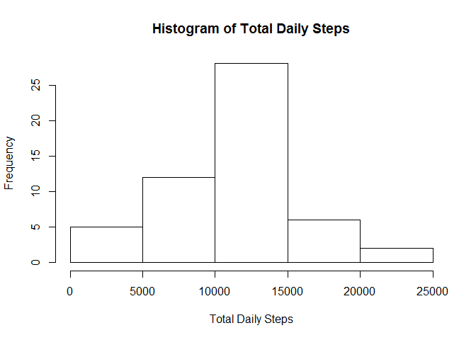
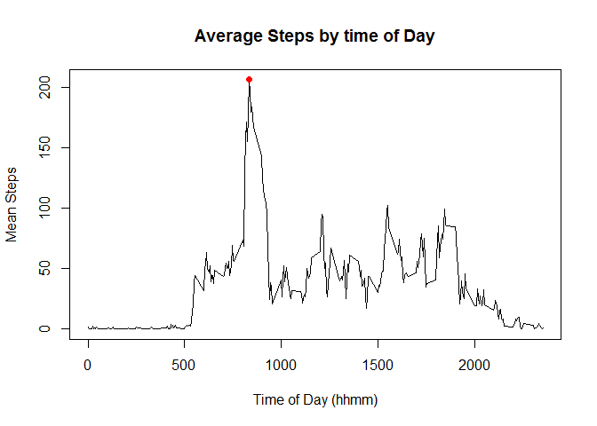
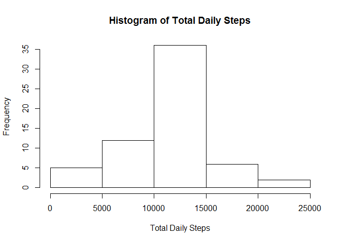
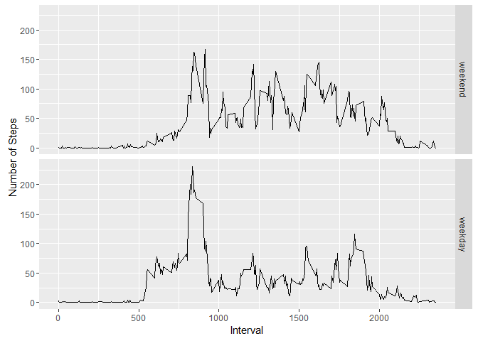

# Reproducible Research: Peer Assessment 1
Tyler Brown  
March 2, 2016  


# Introduction

It is now possible to collect a large amount of data about personal movement using activity monitoring devices such as a Fitbit, Nike Fuelband, or Jawbone Up. These type of devices are part of the "quantified self" movement - a group of enthusiasts who take measurements about themselves regularly to improve their health, to find patterns in their behavior, or because they are tech geeks. But these data remain under-utilized both because the raw data are hard to obtain and there is a lack of statistical methods and software for processing and interpreting the data.

This assignment makes use of data from a personal activity monitoring device. This device collects data at 5 minute intervals through out the day. The data consists of two months of data from an anonymous individual collected during the months of October and November, 2012 and include the number of steps taken in 5 minute intervals each day.

# Project Code

## Loading and preprocessing the data

To read the data into an R environment, the read.csv() function is needed. The activity.csv file can be stored in the data variable using:


```r
rawdata <- read.csv("activity.csv")
```

There are instances of missing data in the data set. They should be removed to facilitate future calculations. This can be accomplished by subsetting and using the complete.cases() function. Also the date variable will be formatted as a date object.


```r
data <- rawdata[complete.cases(rawdata),]
data$date <- as.Date(data$date, format = "%Y-%m-%d")
```

## What is mean total number of steps taken per day?

To calculate the total number of steps per day the following code is used.

```r
data2 <- group_by(data,date)
summary <- summarize(data2,totalsteps=sum(steps))
hist(summary$totalsteps, main = "Histogram of Total Daily Steps", xlab="Total Daily Steps")
```



A table of the total number of steps per day is displayed:

<!-- html table generated in R 3.2.3 by xtable 1.8-2 package -->
<!-- Thu Mar 03 13:39:25 2016 -->
<table border=1>
<tr> <th>  </th> <th> date </th> <th> totalsteps </th>  </tr>
  <tr> <td align="right"> 1 </td> <td> 2012-10-02 </td> <td align="right"> 126 </td> </tr>
  <tr> <td align="right"> 2 </td> <td> 2012-10-03 </td> <td align="right"> 11352 </td> </tr>
  <tr> <td align="right"> 3 </td> <td> 2012-10-04 </td> <td align="right"> 12116 </td> </tr>
  <tr> <td align="right"> 4 </td> <td> 2012-10-05 </td> <td align="right"> 13294 </td> </tr>
  <tr> <td align="right"> 5 </td> <td> 2012-10-06 </td> <td align="right"> 15420 </td> </tr>
  <tr> <td align="right"> 6 </td> <td> 2012-10-07 </td> <td align="right"> 11015 </td> </tr>
  <tr> <td align="right"> 7 </td> <td> 2012-10-09 </td> <td align="right"> 12811 </td> </tr>
  <tr> <td align="right"> 8 </td> <td> 2012-10-10 </td> <td align="right"> 9900 </td> </tr>
  <tr> <td align="right"> 9 </td> <td> 2012-10-11 </td> <td align="right"> 10304 </td> </tr>
  <tr> <td align="right"> 10 </td> <td> 2012-10-12 </td> <td align="right"> 17382 </td> </tr>
  <tr> <td align="right"> 11 </td> <td> 2012-10-13 </td> <td align="right"> 12426 </td> </tr>
  <tr> <td align="right"> 12 </td> <td> 2012-10-14 </td> <td align="right"> 15098 </td> </tr>
  <tr> <td align="right"> 13 </td> <td> 2012-10-15 </td> <td align="right"> 10139 </td> </tr>
  <tr> <td align="right"> 14 </td> <td> 2012-10-16 </td> <td align="right"> 15084 </td> </tr>
  <tr> <td align="right"> 15 </td> <td> 2012-10-17 </td> <td align="right"> 13452 </td> </tr>
  <tr> <td align="right"> 16 </td> <td> 2012-10-18 </td> <td align="right"> 10056 </td> </tr>
  <tr> <td align="right"> 17 </td> <td> 2012-10-19 </td> <td align="right"> 11829 </td> </tr>
  <tr> <td align="right"> 18 </td> <td> 2012-10-20 </td> <td align="right"> 10395 </td> </tr>
  <tr> <td align="right"> 19 </td> <td> 2012-10-21 </td> <td align="right"> 8821 </td> </tr>
  <tr> <td align="right"> 20 </td> <td> 2012-10-22 </td> <td align="right"> 13460 </td> </tr>
  <tr> <td align="right"> 21 </td> <td> 2012-10-23 </td> <td align="right"> 8918 </td> </tr>
  <tr> <td align="right"> 22 </td> <td> 2012-10-24 </td> <td align="right"> 8355 </td> </tr>
  <tr> <td align="right"> 23 </td> <td> 2012-10-25 </td> <td align="right"> 2492 </td> </tr>
  <tr> <td align="right"> 24 </td> <td> 2012-10-26 </td> <td align="right"> 6778 </td> </tr>
  <tr> <td align="right"> 25 </td> <td> 2012-10-27 </td> <td align="right"> 10119 </td> </tr>
  <tr> <td align="right"> 26 </td> <td> 2012-10-28 </td> <td align="right"> 11458 </td> </tr>
  <tr> <td align="right"> 27 </td> <td> 2012-10-29 </td> <td align="right"> 5018 </td> </tr>
  <tr> <td align="right"> 28 </td> <td> 2012-10-30 </td> <td align="right"> 9819 </td> </tr>
  <tr> <td align="right"> 29 </td> <td> 2012-10-31 </td> <td align="right"> 15414 </td> </tr>
  <tr> <td align="right"> 30 </td> <td> 2012-11-02 </td> <td align="right"> 10600 </td> </tr>
  <tr> <td align="right"> 31 </td> <td> 2012-11-03 </td> <td align="right"> 10571 </td> </tr>
  <tr> <td align="right"> 32 </td> <td> 2012-11-05 </td> <td align="right"> 10439 </td> </tr>
  <tr> <td align="right"> 33 </td> <td> 2012-11-06 </td> <td align="right"> 8334 </td> </tr>
  <tr> <td align="right"> 34 </td> <td> 2012-11-07 </td> <td align="right"> 12883 </td> </tr>
  <tr> <td align="right"> 35 </td> <td> 2012-11-08 </td> <td align="right"> 3219 </td> </tr>
  <tr> <td align="right"> 36 </td> <td> 2012-11-11 </td> <td align="right"> 12608 </td> </tr>
  <tr> <td align="right"> 37 </td> <td> 2012-11-12 </td> <td align="right"> 10765 </td> </tr>
  <tr> <td align="right"> 38 </td> <td> 2012-11-13 </td> <td align="right"> 7336 </td> </tr>
  <tr> <td align="right"> 39 </td> <td> 2012-11-15 </td> <td align="right">  41 </td> </tr>
  <tr> <td align="right"> 40 </td> <td> 2012-11-16 </td> <td align="right"> 5441 </td> </tr>
  <tr> <td align="right"> 41 </td> <td> 2012-11-17 </td> <td align="right"> 14339 </td> </tr>
  <tr> <td align="right"> 42 </td> <td> 2012-11-18 </td> <td align="right"> 15110 </td> </tr>
  <tr> <td align="right"> 43 </td> <td> 2012-11-19 </td> <td align="right"> 8841 </td> </tr>
  <tr> <td align="right"> 44 </td> <td> 2012-11-20 </td> <td align="right"> 4472 </td> </tr>
  <tr> <td align="right"> 45 </td> <td> 2012-11-21 </td> <td align="right"> 12787 </td> </tr>
  <tr> <td align="right"> 46 </td> <td> 2012-11-22 </td> <td align="right"> 20427 </td> </tr>
  <tr> <td align="right"> 47 </td> <td> 2012-11-23 </td> <td align="right"> 21194 </td> </tr>
  <tr> <td align="right"> 48 </td> <td> 2012-11-24 </td> <td align="right"> 14478 </td> </tr>
  <tr> <td align="right"> 49 </td> <td> 2012-11-25 </td> <td align="right"> 11834 </td> </tr>
  <tr> <td align="right"> 50 </td> <td> 2012-11-26 </td> <td align="right"> 11162 </td> </tr>
  <tr> <td align="right"> 51 </td> <td> 2012-11-27 </td> <td align="right"> 13646 </td> </tr>
  <tr> <td align="right"> 52 </td> <td> 2012-11-28 </td> <td align="right"> 10183 </td> </tr>
  <tr> <td align="right"> 53 </td> <td> 2012-11-29 </td> <td align="right"> 7047 </td> </tr>
   </table>

The mean number of total steps per day is: 1.0766189\times 10^{4}; the median number of steps per day is: 10765.

## What is the average daily activity pattern?

The following code calculates the mean number of steps observed throughout the time interval (the time of day). A plot is provided to show the average daily activity pattern. The red dot shows the maximum observed mean steps.


```r
summary3 <- group_by(data, interval)
summary3 <- summarize(summary3, meansteps=mean(steps))
plot(x=summary3$interval,y=summary3$meansteps,type="l",main="Average Steps by time of Day",xlab="Time of Day (hhmm)",ylab="Mean Steps")
points(x=summary3$interval[which.max(summary3$meansteps)],y=max(summary3$meansteps),pch=19,col="red")
```



The time of day with the maximum average number of steps is: 0835 (hhmm), with a value of 206.1698113 steps.

## Imputing missing values

Since there are 2304 rows of missing data (where data is NA) in the raw data, it is desired to impute that data. The following code takes the calculation of the mean steps per time interval to fill in those missing values. "data3" is the new data set with the imputed values.


```r
navalues <- is.na(rawdata$steps)
data3 <- rawdata
for (i in 1:length(navalues)) {
     if (navalues[i] == TRUE) {
          data3$steps[i] <- summary3$meansteps[match(data3$interval[i],summary3$interval)]
     }
}
```


### Calculate summary statistics on full data


```r
summary5 <- group_by(data3,date)
summary5 <- summarize(summary5,totalsteps=sum(steps))
hist(summary5$totalsteps, main = "Histogram of Total Daily Steps", xlab="Total Daily Steps")
```



The mean number of total steps per day is: 1.0766189\times 10^{4}; the median number of steps per day is: 1.0766189\times 10^{4}.

This plot shows good agreement with the first histogram produced. Also, the mean and median values for the total daily steps agree with those first calculated prior imputing the missing values. This suggests that the imputing method is sound and the amount of missing values have little practical effect on the analysis.

## Are there differences in activity patterns between weekdays and weekends?

Using the imputed data set of 'data3' we will see if there is a difference in activity pattern between weekdays and weekends. Fist some data manipulations need to be done in order to create a factor variable with the levels of 'weekend' or 'weekday'. Next, summary statistics are made to calculate the mean number of steps in each interval.


```r
data4 <- data3
data4$date <- as.Date(data4$date, format = "%Y-%m-%d")
data4 <- mutate(data4,dayofweek=weekdays(date, abbreviate = TRUE))
weekend <- c("Sat","Sun")
data4 <- mutate(data4,weekend=dayofweek %in% weekend)
data4 <- mutate(data4,weekportion=factor(weekend, levels = c(TRUE,FALSE), labels = c("weekend","weekday")))
data4 <- select(data4,-weekend)
data4 <- select(data4,-dayofweek)

summary6 <- group_by(data4,weekportion,interval)
summary6 <- summarize(summary6,numsteps=mean(steps))

qplot(x=interval,y=numsteps,data = summary6, geom = "line", facets = weekportion~.,ylab="Number of Steps",xlab="Interval")
```



The results of the plot show that overall the activity graphs are similar. However, some features may be interesting to a researcher. First, on weekdays between 0500 and 0900 there is moderate activity, while there is little activity at these times on the weekends. This may be going to work. Secondly, between 1000 and 2000 on weekends there is a consistent moderate level of activity that it not seen on the weekdays.
